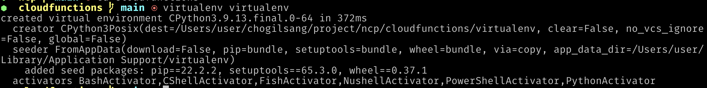

```sh
# Mac & Linux

ruby -e "$(curl -fsSL https://raw.githubusercontent.com/Homebrew/install/master/install)"

# STEP1. 설치
pip3 install virtualenv

virtualenv virtualenv
virtualenv virtualenv --python=python3.7
source virtualenv/bin/activate

# error 시
# pip 업그레이드 명령 시 PIP 패키지 삭제 후 발생하는 에러처리
python -m ensurepip

pip3 install boto3


python -c 'import sys; print(sys.getdefaultencoding())'
export PYTHONIOENCODING=utf8

# virtualenv 나가기
deactivate
```

# [Python] Mac에서 파이썬 기본 버전 변경 방법
# https://heytech.tistory.com/317

ls -l /usr/local/bin/python*
https://www.python.org/downloads/release/python-379/
sudo ln -s -f /usr/local/bin/python3.7 /usr/local/bin/python

vi ~/.zshrc
alias python='/usr/local/bin/python3.7'
source ~/.zshrc




https://guide.ncloud-docs.com/docs/cloudfunctions-example-python#%EC%9D%98%EC%A1%B4%EC%84%B1-%ED%8C%8C%EC%9D%BC%EC%9D%84-%ED%95%A8%EA%BB%98-%ED%8C%A8%ED%82%A4%EC%A7%95%ED%95%98%EC%97%AC-%EC%95%A1%EC%85%98-%EC%83%9D%EC%84%B1